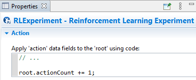

Order of events with the 'takeAction' function
==============================================

.. epigraph::
    **Summary:** When the ``takeAction`` function is called, the model responds in a way that may be counterintutive. If wanting to perform event-sensitive code around the iteration, knowing how this works is important.

Background information
----------------------

On the topic of event scheduling in an AnyLogic model, the AnyLogic
engine handles much of the low-level complexity. Typically it is not
necessary for end-users to know about the technical nuances involved.
However, as the specific order that events or Java code gets executed is
critically important in RL workflows, it's important to know some
information about this complexity. We'll start with a basic
introduction.

As your model is running, the AnyLogic engine will encounter various
events and callback fields (e.g., "On exit" of a Source block). When
this happens, it will execute the relevant block of code in its
entirety, from top to bottom, before moving on to the next event. In
code blocks, there are generally three types of statements that will get
executed:

* Simple actions, such as variable assignments or basic Java functions. These will take effect immediately and are resolved by the next line of code.

    *   For example, incrementing a variable or calling console-outputting functions in a callback field.

    .. figure:: _static/adv-order-events-takeaction-01.png
      :scale: 100 %
      :alt: Incrementing a variable from a source block
      :align: center

    .. figure:: _static/adv-order-events-takeaction-02.png
      :scale: 100 %
      :alt: Console output reporting incremented variable
      :align: center

*  Event-scheduling actions, such as creating a dynamic event or adding agents to a process. These are *scheduled* immediately, but not *executed* *upon* until sometime after the entire code block executes.

    *   For example, say you have a Source block that has arrivals
        defined by "Calls of inject() function". In the "On startup"
        callback field, if you manually add agents via inject() and then
        try immediately outputting how many agents that have left the
        Source block, it will report 0. It's not until *after* the code
        block that the agents get created and the count attribute gets
        updated.

    .. figure:: _static/adv-order-events-takeaction-03.png
      :scale: 100 %
      :alt: Example of event-delayed statistic reporting
      :align: center

* Engine-level actions, such as pausing or ending the simulation run (via pauseSimulation() or finishSimulation(), respectively). These work similarly to #2 in that they are *scheduled* but not *executed upon* until after the code block. The difference is that they take a higher priority compared to event-scheduling actions.

    *   For example, say you have a Source block that has arrivals
        defined by "Calls of inject() function." You also have an Event
        setup to fire at time 5, where it injects 10 agents and then
        pauses the simulation. The result is that the model is paused
        after the code block, but before the agents could be injected
        (indicated by the counter reading "0" in the image below).

    .. figure:: _static/adv-order-events-takeaction-04.png
      :scale: 100 %
      :alt: Example of engine-level action
      :align: center

Relevance to RL workflows
-------------------------

Based on the context provided, it can be seen that the ``takeAction``
function would fall under the third case, as it effectively pauses the
model's execution in order to allow the RL iteration to execute
(observation + action).

Simply stated, the code related to your RL experiment's Observation or
Action will not be executed until after the entire code block that
called the ``takeAction`` function. As a result of this, any code that
you wish to execute *after* the RL Action is taken should be placed in a
separate event.

For example, say we have the code field in the RL Experiment's Action
callback that incremented some counter variable in the top-level agent;
in our model is an event that calls \`takeAction\` and then prints out
the counter variable. What gets shown in the console will be 0 because
-- like the call to pause the simulation in the earlier example -- the
event was scheduled but not yet executed upon!

.. figure:: _static/adv-order-events-takeaction-06.png
  :scale: 100 %
  :alt: Example of RLExperiment action field being delayed
  :align: center
